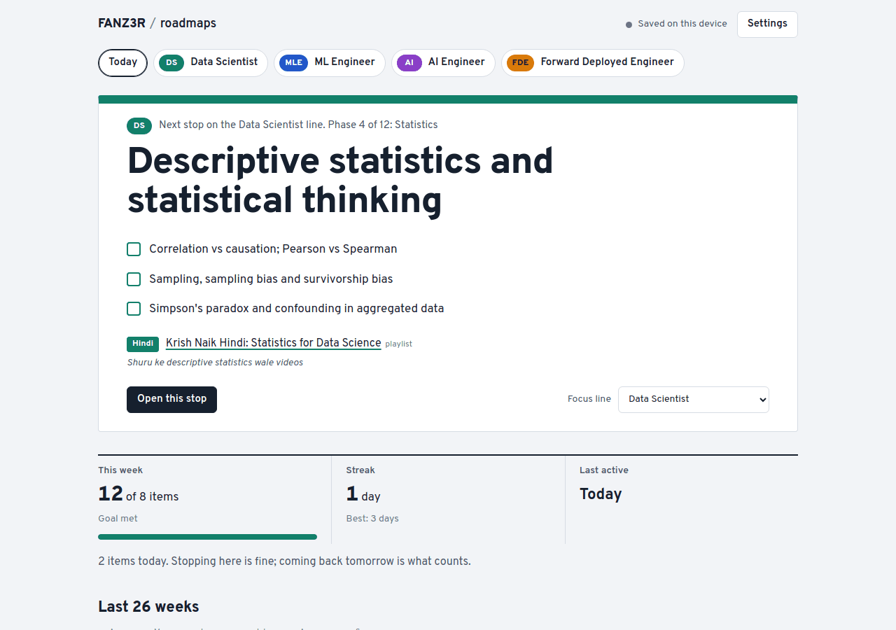
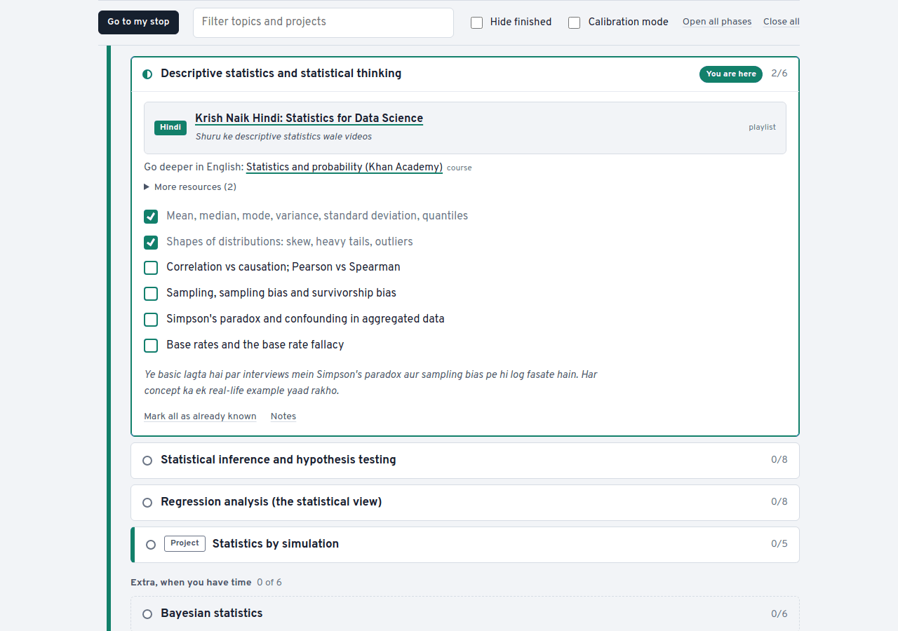
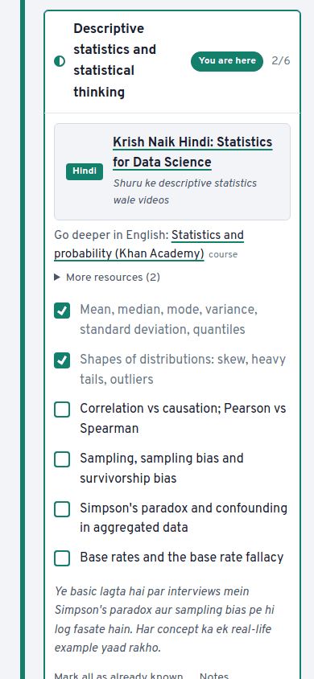

# roadmaps

Four career roadmaps on one static site, each built from scratch with the best free resource for every topic, projects with clear "done when" criteria, and progress you can tick off from any device.

| Line | Phases | Core topics | Extra topics | Projects | Core items |
|---|---|---|---|---|---|
| Data Scientist (DS) | 12 | 37 | 16 | 11 | 332 |
| ML Engineer (MLE) | 11 | 50 | 9 | 10 | 411 |
| AI Engineer (AI) | 11 | 38 | 8 | 10 | 322 |
| Forward Deployed Engineer (FDE) | 10 | 46 | 4 | 10 | 362 |

Every topic has one clear place to learn it. For 51 topics that is a Hindi YouTube source (CampusX, Krish Naik Hindi, Gate Smashers, TrainWithShubham, Chai aur Code and others) with a note on which videos to watch. For the rest it is the best free English course or book, since no Hindi source is good enough there yet. One "go deeper" link sits under each pick, and anything else is folded away.

Each phase separates the core path from optional topics ("Extra, when you have time"). Progress, pace and the next stop only count the core path, and one topic on each line is marked "You are here".

Topics live in one shared library, so 58 of them are interchanges used by two or more lines: tick an item once and it counts everywhere.

No build step and no dependencies. It is plain HTML, CSS and JavaScript.



<p>
  
  
</p>

<sub>Screenshots use sample progress.</sub>

## Put it on GitHub Pages

1. Create a public repository named `roadmaps` on your account.
2. Push this folder to it:
   ```bash
   cd roadmaps
   git init -b main
   git add .
   git commit -m "Roadmaps site"
   git remote add origin https://github.com/FANZ3R/roadmaps.git
   git push -u origin main
   ```
   If you upload through the web instead, make sure the hidden `.github` folder comes along, or the checks will not run.
3. In the repository, open Settings, then Pages. Under "Build and deployment", choose "Deploy from a branch", branch `main`, folder `/ (root)`, and save.
4. After a minute the site is live at `https://fanz3r.github.io/roadmaps/`.

The repository is public, but your progress is not in it. Progress lives in your browser and, if you connect sync, in a secret gist.

## Sync across devices

1. Create a classic token with only the `gist` scope: <https://github.com/settings/tokens/new?scopes=gist&description=roadmaps-sync>. Pick an expiry you are comfortable renewing. A fine-grained token with read and write access to Gists also works.
2. On each device, open the site, go to Settings, paste the token and choose "Connect and sync".
3. The first device creates one secret gist with a file named `roadmaps-progress.json`. Every other device finds that gist and uses it.

How it behaves: every tick, note and setting carries its own timestamp, and devices merge item by item with the newest change winning. Edits sync two seconds after you stop clicking, when you switch away from the tab, and when you come back to it. Offline edits sync once you are back online.

Security notes:

- The token is stored in this browser's localStorage and is only ever sent to `api.github.com`.
- Every project site under `fanz3r.github.io` shares one browser origin, so any page you publish there could read that storage. Keep the token limited to the gist scope and do not host code you do not trust on your github.io pages.
- A secret gist is unlisted, not private: anyone with its exact URL can view it. It only contains tick marks, timestamps and your notes, so do not paste anything sensitive into notes.
- Revoke the token at any time at <https://github.com/settings/tokens>. Disconnecting a device in Settings removes the token from that browser.

## How to use it without burning out

- **Week one: calibrate.** Open each line, turn on calibration mode, and tick only what you can explain and implement without notes. Calibration ticks are stored as prior knowledge: they count toward progress but never toward streaks or the weekly goal, so the numbers stay honest.
- **One focus line.** The Today page shows the next stop on your focus line: the next few unticked items and the video or course to start with. You never have to decide what to study next.
- **Follow "You are here".** On a line page, only the current topic is open. Finish it and it folds away while the next one opens. "Go to my stop" jumps back to it. Leave the Extra topics for later; they never block the next stop.
- **A weekly goal you can hit in a bad week.** Set it in Settings. Consistency beats intensity.
- **Never miss twice.** One missed day is normal. The Today page nudges you after two.
- **Notes.** Every topic and project has a notes box for repo links, write-ups, or what finally clicked. Notes sync too.

Keyboard: press `/` on a line page to jump to the filter box.

## Editing and adding content

Topics live in `data/topics/*.js` and roadmaps in `data/roadmaps/*.js`. The format is documented at the top of `data/topics/core.js` and `data/roadmaps/data-scientist.js`.

- **Progress is keyed by item text.** Rewording an item resets that one tick. Reordering items, topics or phases is always safe. Renaming a topic id or project id resets its ticks, so keep ids stable.
- **Add a topic:** add it to any topic file, then list its id in a phase of one or more roadmaps, under `topics` for the core path or `extra` for optional.
- **Hindi picks:** set `hi: ["Channel: playlist", "url", "which videos to watch"]` on a topic. Playlist links were verified when added. A few picks are YouTube searches pre-filled with the channel and topic, used where the exact playlist link could not be verified; replace them with the playlist URL once you find it.
- **Add a roadmap** (for example Software Engineer or Full Stack): copy a roadmap file, change `id`, `code`, `title`, `color`, `colorDark` and `summary`, build the phases mostly from existing topic ids, then add one `<script>` line for the new file in `index.html`. Most of a software engineering or full-stack path already exists as topics (Python, DSA, OS, networking, databases, system design, web, TypeScript, React, APIs, testing, Docker, CI/CD).
- **Check before pushing:** `node scripts/validate.mjs` loads the data exactly as the site does and reports unknown ids, duplicates, bad links and files that `index.html` forgets to load. If the data has a problem, the site itself also shows a notice at the top.

## Automatic checks

- **validate** runs on every push and pull request.
- **links** runs every Monday at 09:00 IST, whenever `data/` changes, and on demand from the Actions tab. A link that returns 404 or 410, or whose domain no longer resolves, fails the run. Sites that block automated requests (401, 403, 429), server errors and timeouts are listed as warnings to check by hand. Results appear in the run summary. GitHub pauses scheduled workflows after 60 days without repository activity; re-enable it from the Actions tab if that happens.

Run them locally with `node scripts/validate.mjs` and `python3 scripts/check_links.py`.

## Local preview

```bash
python3 -m http.server 8000
```

Then open <http://localhost:8000>. Browser storage is separate per address, so local progress is not the same as the live site's unless you connect sync or use Export and Import in Settings.

## Files

```
index.html                   page shell, data registry, script order
assets/app.js                rendering, progress, stats, gist sync
assets/style.css             transit-line visual system, light and dark
data/topics/*.js             shared topic library (items, resources, study tips)
data/roadmaps/*.js           the four lines: phases, topic ids, projects
scripts/validate.mjs         data validator (Node, no packages)
scripts/check_links.py       link checker (Python standard library)
docs/                        preview images for this README
.github/workflows/           validate and links workflows
```
